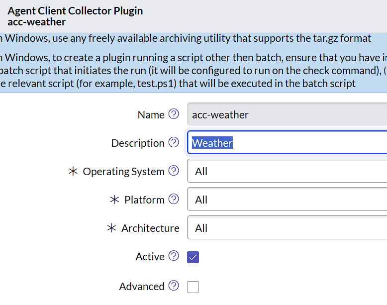
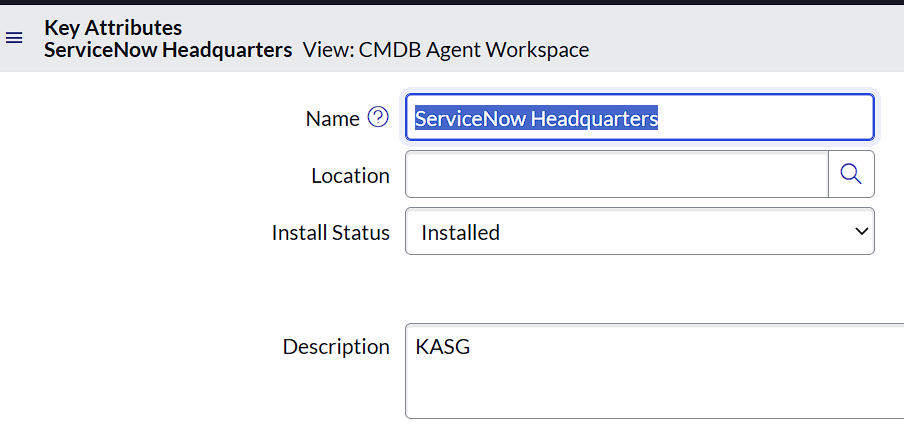
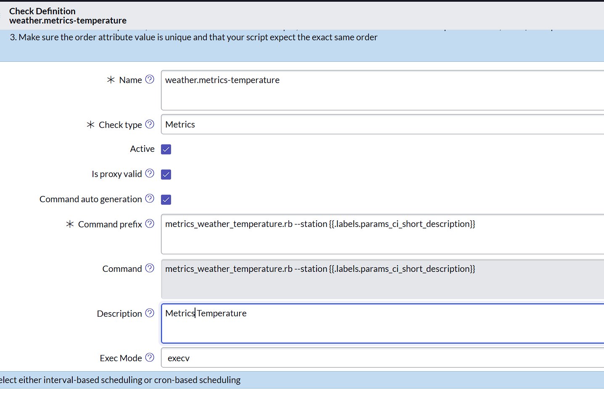
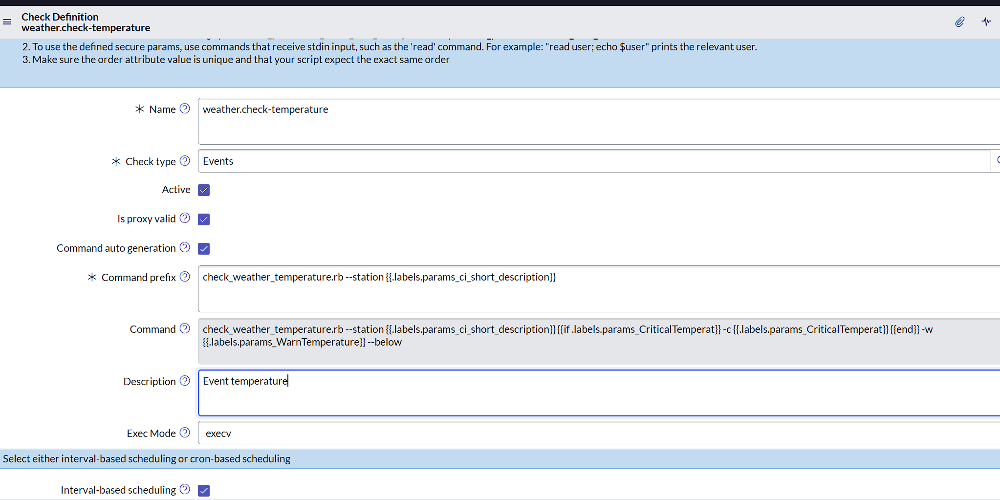
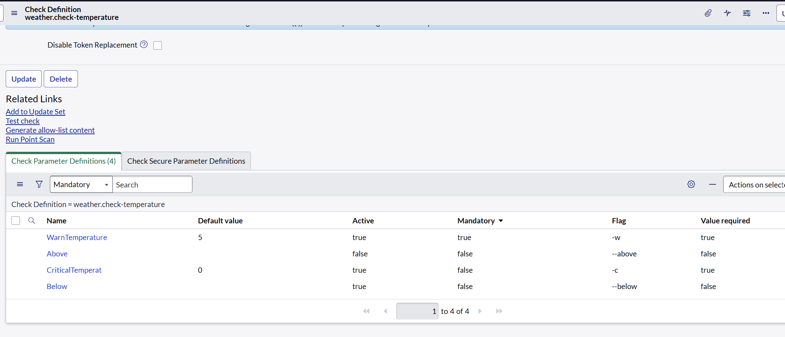
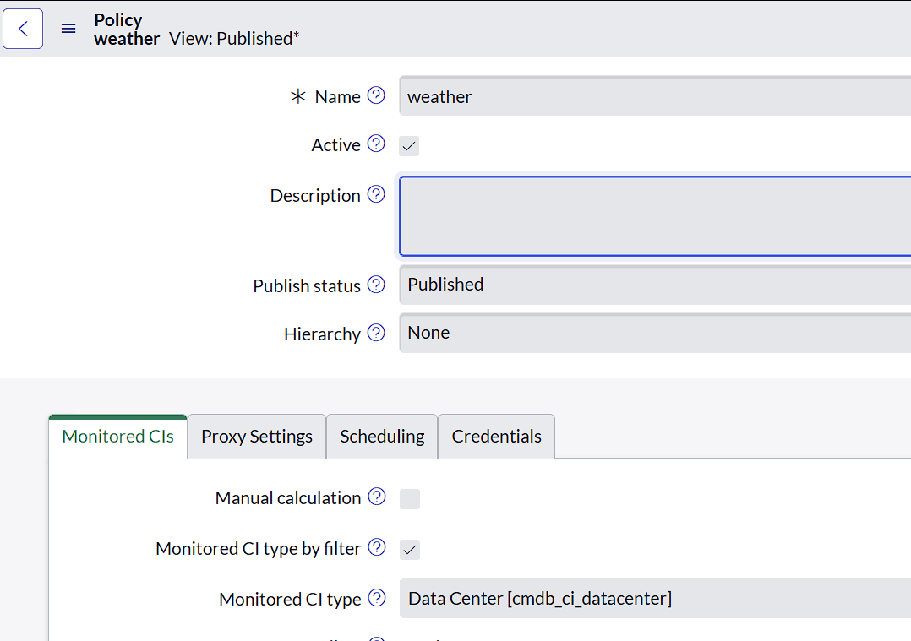
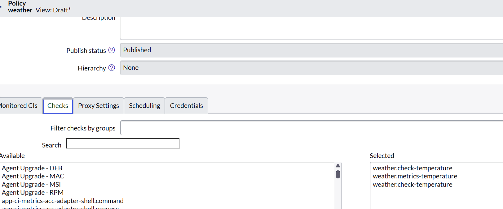
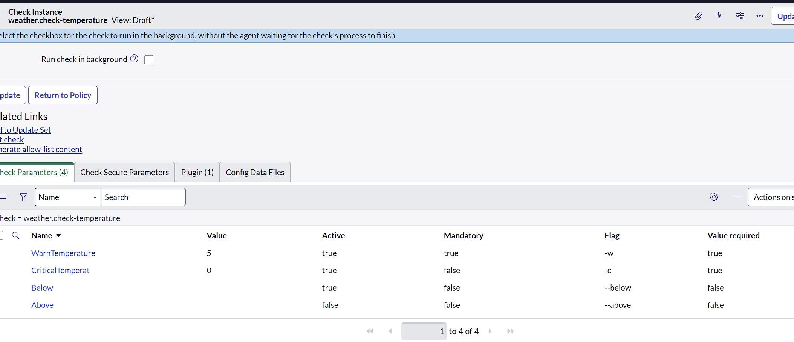

# Configure ACC Weather in ServiceNow

This guide sets up the `acc-weather` 0.2.0 temperature plugin, its metric and
event check definitions, and a policy targeting data center CIs. Screenshots show
the supplied example configuration. Choose your own proxy agent, monitored CIs,
schedules, thresholds, and number of event check instances.

The plugin contains two Ruby scripts: `metrics_weather_temperature.rb` collects
temperature; `check_weather_temperature.rb` evaluates temperature thresholds.
One event script supports both high and low checks through separate instances.
All temperatures and threshold values in this guide are Celsius.

## 1. Register the plugin

Upload `dist/signed/acc-weather.tar.gz` and register version 0.2.0. Trust the
accompanying public signing certificate through your normal ACC procedure.

| Field | Setting |
| --- | --- |
| Name | `acc-weather` |
| Description | `Weather` |
| Operating System | All |
| Platform | All |
| Architecture | All |
| Active | Checked |
| Advanced | Unchecked |



*Plugin configuration supplied for this guide.*

The package contains:

```text
allow_list/check-allow-list.json
bin/check_weather_temperature.rb
bin/metrics_weather_temperature.rb
```

Configure platform applicability on the instance as shown; local build metadata
does not configure the instance automatically. Associate `acc-weather` with both
check definitions through their Plugin related list. When upgrading, remove
superseded definitions from active policies.

## 2. Configure each data center CI for the demo

Open each **Data Center** CI (`cmdb_ci_datacenter`) selected by the weather policy.
For this demo, enter the identifier of the nearest **National Weather Service
(NWS) observation station** in the **Description** field as a single line. Store
only the station ID: no station name, explanatory sentence, URL, or extra lines.

| Field | Configuration |
| --- | --- |
| Name | Your data center's name |
| Description | Nearest NWS observation station ID on one line; use `KSJC` for this Santa Clara demo |
| Location | Maintain according to your CMDB requirements; these scripts do not use it to choose a station |
| Install Status | Installed in the supplied example; maintain according to your CI lifecycle |

For the **Santa Clara, California** demo, use **`KSJC` — San Jose International
Airport**. The [NWS Santa Clara page](https://forecast.weather.gov/MapClick.php?lat=37.3558&lon=-121.9595)
uses this station for current conditions. Select a station appropriate to the
physical location when configuring other data centers.



**Screenshot correction:** the original image contains `KASG`. For this Santa
Clara demo, enter **`KSJC`** instead. The image is retained to show the field's
location, not the corrected value. The blank Location in the screenshot is not
a recommendation to clear location information.

### Find the nearest station

Use these official NWS resources:

- [Observation station directory by state or territory](https://forecast.weather.gov/xml/current_obs/): select the data center's state or territory and find nearby observation locations.
- [Complete station index for the NWS current-observation directory (XML)](https://forecast.weather.gov/xml/current_obs/index.xml): a searchable/downloadable list containing station IDs, names, states, and coordinates.
- [NWS station information search](https://www.weather.gov/tg/siteloc): look up a station identifier and its coordinates, or list stations by state or country.

Compare station locations with the physical data center location to select the
nearest station. Before using it, test the temperature check with that identifier
and confirm that NWS returns an observation with a temperature value. Inclusion
in a directory alone does not confirm current temperature availability in the
API. If the nearest station has no usable observation, select a suitable nearby
reporting station and record that choice for the demo.

### Connect the CI field to the check commands

The screenshot labels the field **Description**. The supplied check definitions
read the station through the **short-description label token**:

```text
{{.labels.params_ci_short_description}}
```

Verify that the field you populated is the one exposed by this token in your
instance. The resolved command must contain, for this demo, `--station KSJC`, not
an empty value or descriptive text. If Description and Short description are
different fields in your configuration, align the populated field and token
mapping before running the policy.

The scripts do not query the CMDB or derive a station from coordinates or an
address. ServiceNow supplies the already-selected identifier. Using Description
for the station is a **demo convention**. If your organization needs that field
for descriptive text, use a dedicated station field and update the label mapping
and both command prefixes accordingly.

## 3. Create the metric check definition

| Field | Setting |
| --- | --- |
| Name | `weather.metrics-temperature` |
| Check type | Metrics |
| Active | Checked |
| Is proxy valid | Checked |
| Command auto generation | Checked |
| Description | `Metrics Temperature` |
| Exec Mode | `execv` |
| Plugin dependency | `acc-weather` |

Set **Command prefix** to:

```text
metrics_weather_temperature.rb --station {{.labels.params_ci_short_description}}
```

The generated **Command** should match that prefix. The station is already
supplied in the prefix; do not append it a second time through a parameter.
No warning, critical, Above, or Below parameters belong on this metric check.



The script emits one Graphite measurement:

```text
weather.temperature_c <Celsius-value> <observation-epoch-seconds>
```

Set the display units to Celsius. The timestamp is the observation time. Keep
separate target/check context for each data center: the metric name is identical
for every station and does not itself identify or bind a CI.

## 4. Create the event check definition

| Field | Setting |
| --- | --- |
| Name | `weather.check-temperature` |
| Check type | Events |
| Active | Checked |
| Is proxy valid | Checked |
| Command auto generation | Checked |
| Description | `Event temperature` |
| Exec Mode | `execv` |
| Disable Token Replacement | Unchecked |
| Plugin dependency | `acc-weather` |

Set **Command prefix** to:

```text
check_weather_temperature.rb --station {{.labels.params_ci_short_description}}
```

The parameter definitions in the next step supply thresholds and direction.
Keep these instance-specific settings out of the prefix so different policy
instances can use the same definition.



*The screenshot shows a generated command for the low-temperature example.
Its conditional critical argument is not a reason to omit the required value.*

## 5. Define all four event parameters

On **weather.check-temperature**, use the **Check Parameter Definitions** related
list to create the following four records. Do this at the **check definition**
level first, then configure values and active direction on each policy's
**check instance**.

| Name | Example default value | Active in the low-temperature example | Mandatory | Flag | Value required |
| --- | --- | --- | --- | --- | --- |
| `WarnTemperature` | `5` | true | true | `-w` | true |
| `CriticalTemperat` | `0` | true | **true** | `-c` | true |
| `Above` | Leave blank | false | false | `--above` | false |
| `Below` | Leave blank | true | false | `--below` | false |

The name `CriticalTemperat` preserves the spelling in the supplied example.
Parameter names are used in generated label references; keep them consistent.
The Ruby script itself receives `-c`, not the parameter's display name.



**Correction to the screenshot:** it shows `CriticalTemperat` as Mandatory =
false. Set it to **true** because the script always requires `-c`. Keep both
thresholds active and mandatory. Zero is a valid critical value: verify the
generated command includes `-c 0`, rather than omitting the argument.

The direction flags have no value. Enable **exactly one** per check instance.
Both are individually non-mandatory because either direction may be selected;
the script still requires one direction. If both are passed, the last one wins.

The example defaults are 5°C warning and 0°C critical with Below active. They
are instance configuration examples, not script defaults or universal limits.
The script has no built-in threshold defaults.

## 6. Create the weather policy and select CIs

| Field | Example setting |
| --- | --- |
| Name | `weather` |
| Active | Checked |
| Hierarchy | None |
| Manual calculation | Unchecked |
| Monitored CI type by filter | Checked |
| Monitored CI type | Data Center [`cmdb_ci_datacenter`] |

On **Monitored CIs**, set the filter to the data centers you intend to monitor.
The screenshot shows the CI type but does not show the filter conditions; select
those for your environment. Confirm that each selected CI has a station ID in
the field used by your command prefix.



*The supplied policy screenshot shows Published status. When creating or changing
a policy, complete the configuration and publish through your normal workflow.*

### Select your proxy agent

On **Proxy Settings**, choose the ACC agent that will execute the checks for the
data center targets. It must be able to reach `api.weather.gov` over HTTPS.
Do not copy an agent identity from another environment.

| Field | Setting in the supplied example |
| --- | --- |
| Single proxy agent | Checked |
| Proxy agent | **Select your ACC proxy agent** |
| Multi-proxy agents by cluster | Unchecked |
| Multi-proxy agents by script | Unchecked |
| Run checks on all proxy agents (No load balancing) | Checked |

These are the example's single-agent settings. Choose proxy topology and load
distribution appropriate to your environment. The original proxy screenshot is
not included because it contains an environment-specific agent name.

Verify the policy's target/proxy association routes results to the data center
CI. The scripts do not assign results to a CI themselves.

## 7. Select checks and configure each instance

On the policy's **Checks** tab, select the metric check and the event checks you
want to run. **The number of event checks is your choice.**

The supplied example has:

- One `weather.metrics-temperature` instance for collection.
- One `weather.check-temperature` instance using `--above`.
- One `weather.check-temperature` instance using `--below`.



*Both event entries can display the same definition name. Open each instance
to verify its direction and thresholds. Two event checks are an example, not a
requirement. The screenshot is from the policy's Draft view.*

### Low-temperature example

Open the event **check instance** under the policy and configure **Check
Parameters** as follows:

| Parameter | Value | Active | Mandatory | Flag | Value required |
| --- | --- | --- | --- | --- | --- |
| `WarnTemperature` | `5` | true | true | `-w` | true |
| `CriticalTemperat` | `0` | true | **true** | `-c` | true |
| `Below` | Leave blank | true | false | `--below` | false |
| `Above` | Leave blank | false | false | `--above` | false |



**Correction to the screenshot:** set the critical parameter to Mandatory =
true on the definition and verify it on the instance. The screenshot also shows
**Run check in background** unchecked; keep foreground execution for collecting
the process output and exit status.

For an example station `KSJC`, verify the resolved command includes:

```text
check_weather_temperature.rb --station KSJC -w 5 -c 0 --below
```

The argument order may differ in the generated command; the script uses named
flags. Required values and the single selected direction must all be present.

| Observed temperature | Result |
| --- | --- |
| Greater than 5°C | OK |
| Greater than 0°C and at or below 5°C | WARNING |
| At or below 0°C | CRITICAL |

### High-temperature example

If a high-temperature event is wanted, configure another instance of the same
event definition. Activate Above and deactivate Below. Choose warning and
critical values such that **critical is greater than warning**.

For example only, warning 30°C and critical 35°C would produce:

```text
check_weather_temperature.rb --station KSJC -w 30 -c 35 --above
```

This is WARNING from 30°C up to, but not including, 35°C; CRITICAL at or above
35°C. For low-temperature checks, **critical must be less than warning**.
Critical takes precedence when both thresholds are crossed.

## 8. Set the schedule, verify and publish

The event-definition screenshot shows interval-based scheduling selected. It
does not show an interval value. Choose a polling interval and timeout suitable
for your environment and station reporting frequency. An initial 600-second
interval with staggered checks and a 60-second outer timeout is a suggested
starting point, not a setting confirmed by the screenshots.

Before publishing, verify:

1. The target CI field resolves to a valid station ID.
2. Both definitions reference the `acc-weather` plugin.
3. Every event instance supplies `-w`, `-c` and exactly one direction flag.
4. Zero thresholds remain present in the generated/resolved command.
5. Your selected proxy agent can retrieve observations over HTTPS.
6. Events and metrics are associated with the intended data center CI.

Use **Test check** to inspect command output. Publish the policy after completing
your checks. Confirm observed results and metric ingestion; the supplied form
screenshots establish configuration examples, not proof of successful execution.

## Runtime and allow-list details

Follow a working embedded-Ruby `.rb` check on your deployed ACC version. Do not
rely on Windows file associations. Standalone tests can explicitly invoke the
embedded Ruby executable followed by the script path.

The bundled allow list names only the two temperature scripts, permits variable
arguments, and disables shell execution. Merge its entries into the configured
agent allow list, preserving unrelated entries. Use **Generate allow-list
content** where appropriate for your instance's command configuration. If your
ACC version requires an explicit interpreter command, generate the matching
entry rather than allowing arbitrary Ruby execution.

Successful event evaluations exit 0 OK, 1 WARNING or 2 CRITICAL. The metric
script exits 0 after emitting one measurement. Request or validation exceptions
exit 1, write diagnostics to stderr and emit no normal stdout result. Account
for exit 1 being shared by exceptions and threshold WARNING.

The supplied scripts do not enforce freshness, inspect `unitCode`, set an
application-specific NWS User-Agent, or configure explicit HTTP timeouts. The
outer ACC timeout and application identification limitation still apply. See
the [README](../README.md#current-script-behavior) for details. This documentation
update does not change the scripts.
